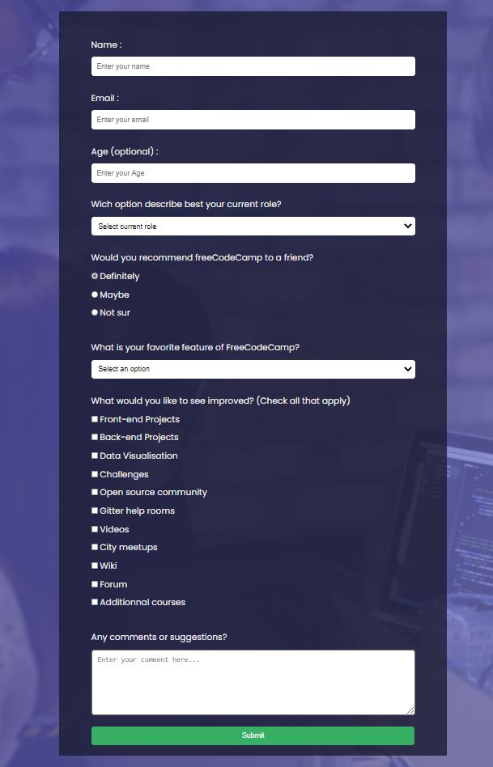

# 🚀 Survey Form  🚀

## Stacks :

* html
* css
* animation
* responsive web design
* Accessibility
* SEO (Search Engine Optimization)
* ...

## Live demo :
* Survey Form : [Codepen](https://codepen.io/xavier-pierre-dev/pen/poeRbLV "live demo") 

__Note : Live demo on codepen__
  
Of course this kind of project seem basic, but in reality they are good for them purpose, learning by practice how to do visual design on webpage using only __html__ and __css__. The class treat also about accessibility, seo purpose, and also __animation__ because yes we can do animation in html/css only and that's allow us to obtain more performance than using a framework for that or javascript. Or performance is one of the important criteria for seo. Minimum html/css should always be prioritize before using javascript or a framework for this purpose. 

