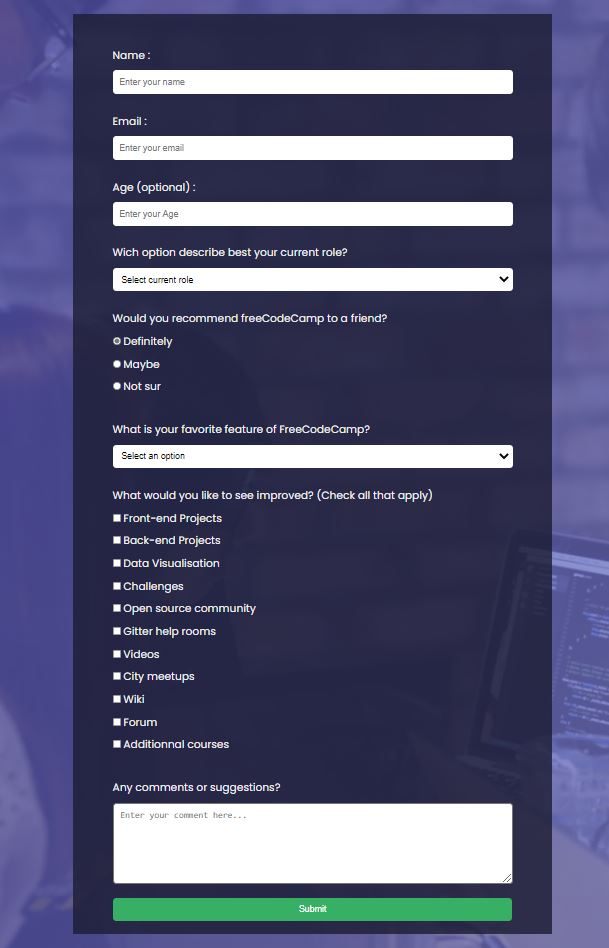
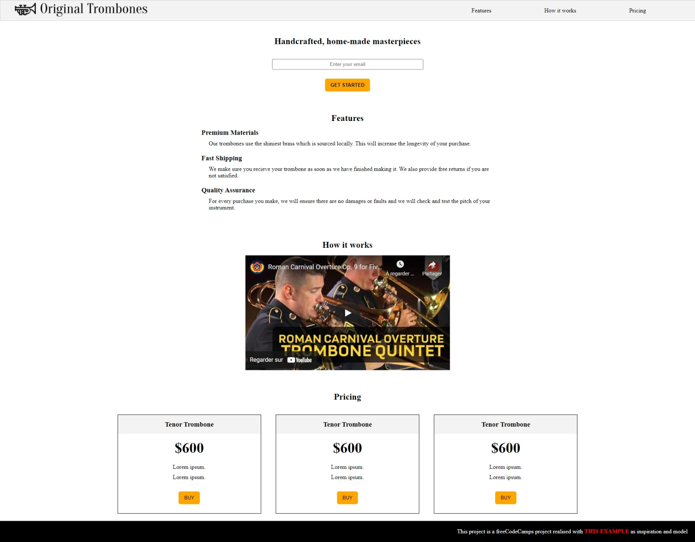
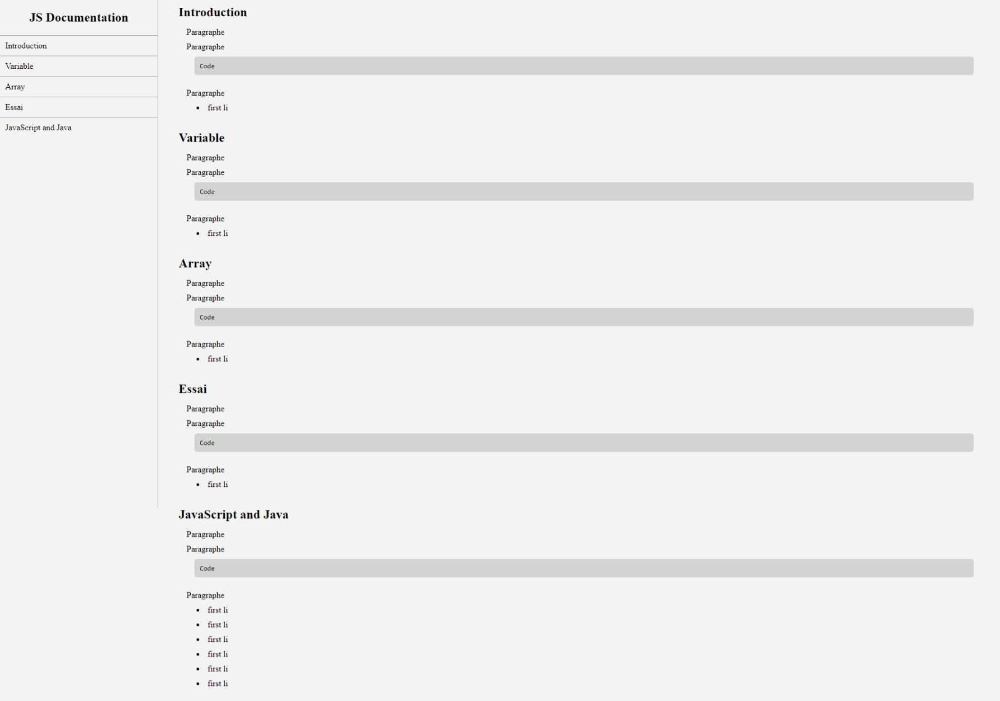
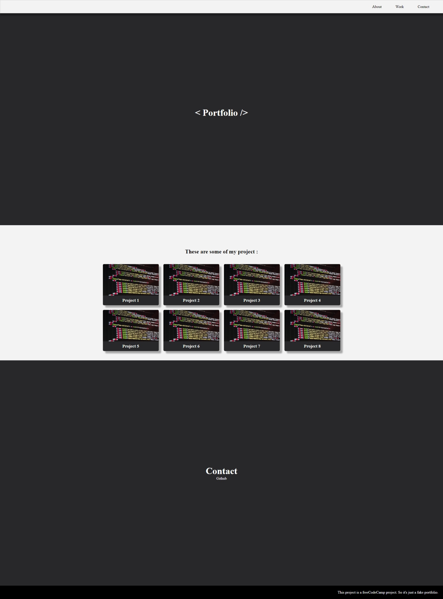

# 🚀 Freecodecamp certification : Responsive web design  🚀
online course : https://www.freecodecamp.org/learn/responsive-web-design/
## Stacks :

* html
* css
* animation
* responsive web design
* Accessibility
* SEO (Search Engine Optimization)
* ...

## __Project :__
* Tribute Page : [Codepen](https://codepen.io/xavier-pierre-dev/pen/vYxyzbr "live demo") 
* Survey Form : [Codepen](https://codepen.io/xavier-pierre-dev/pen/poeRbLV "live demo") 
* Landing Page : [Codepen](https://codepen.io/xavier-pierre-dev/pen/GRWWxeZ "live demo")  
* Technical Documentation Page : [Codepen](https://codepen.io/xavier-pierre-dev/pen/qBrrENd "live demo")  
* Personal Portfolio Webpage : [Codepen](https://codepen.io/xavier-pierre-dev/pen/mdWWoPY "live demo")  

__Note : Live demo on codepen__
  
Of course this kind of project seem basic, but in reality they are good for them purpose, learning by practice how to do visual design on webpage using only __html__ and __css__. The class treat also about accessibility, seo purpose, and also __animation__ because yes we can do animation in html/css only and that's allow us to obtain more performance than using a framework for that or javascript. Or performance is one of the important criteria for seo. Minimum html/css should always be prioritize before using javascript or a framework for this purpose. 

## __Screenshot view :__

<CODE>Survey Form</CODE>

[Codepen](https://codepen.io/xavier-pierre-dev/pen/poeRbLV "live demo")

<CODE>Landing Page</CODE>

[Codepen](https://codepen.io/xavier-pierre-dev/pen/GRWWxeZ "live demo")

<CODE>Technical Documentation Page </CODE>

[Codepen](https://codepen.io/xavier-pierre-dev/pen/qBrrENd "live demo")

<CODE>Personal Portfolio Webpage</CODE>

[Codepen](https://codepen.io/xavier-pierre-dev/pen/mdWWoPY "live demo")

## __Cheatsheet :__

Work in progress

## __Storytelling__ : Why did i decid to get this certification ? 
First, I started web development because the scope that the web has nowadays is incredible. So I was very excited about web development. So I started to create web projects by following tutorials and I went directly to projects involving a lot of things like clones application and a social network by following many tutorials. 

The more I progressed by practicing, the more I was into web development. I became more and more enthusiastic and passionate. I started to add features to the projects I made via tutorials, I also started to learn about the eco-system in web development, the different libraries, frameworks, what recruiters are looking for as profile etc... I started to devour a lot of content, youtube video, article, documentation... And I got even more excited about the future possibilities.

Currently web development allows to create websites but that's not all:
- website : gatsby, react, vue.js, node.js, ...
- mobile app (ios, android) : react-native, ionos, flutter ...
- desktop app : electron, ...

The possibilities are immense... The environment is in constant effervescence, more and more powerful frameworks are created every day. 

But I started with React and even if react uses the base html, css, js, ... This one does it in its own way like every framework. I had originally planned to continue on React, then learn react-native, electron... 

However with hindsight now, I realize that it's probably not the best thing to do to limit myself to a single ecosystem. Therefore I decided to review the foundations to get a solid base, that will allow me to progress much faster in futur. And so I decided to tackle the freecodecamp certification based on projects for that, and maybe odin project after that. 

Then I will start again the development with the help of frameworks but this time with the goal of making comparisons between the different solutions, on the ease of coding with, the performances, them eco-system, their strength and their weakness etc... 
